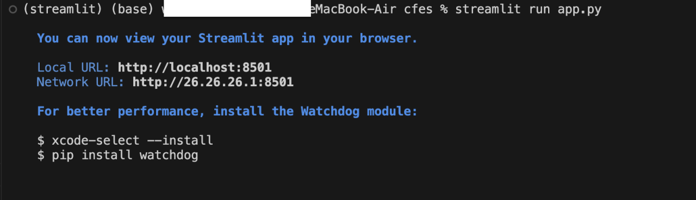
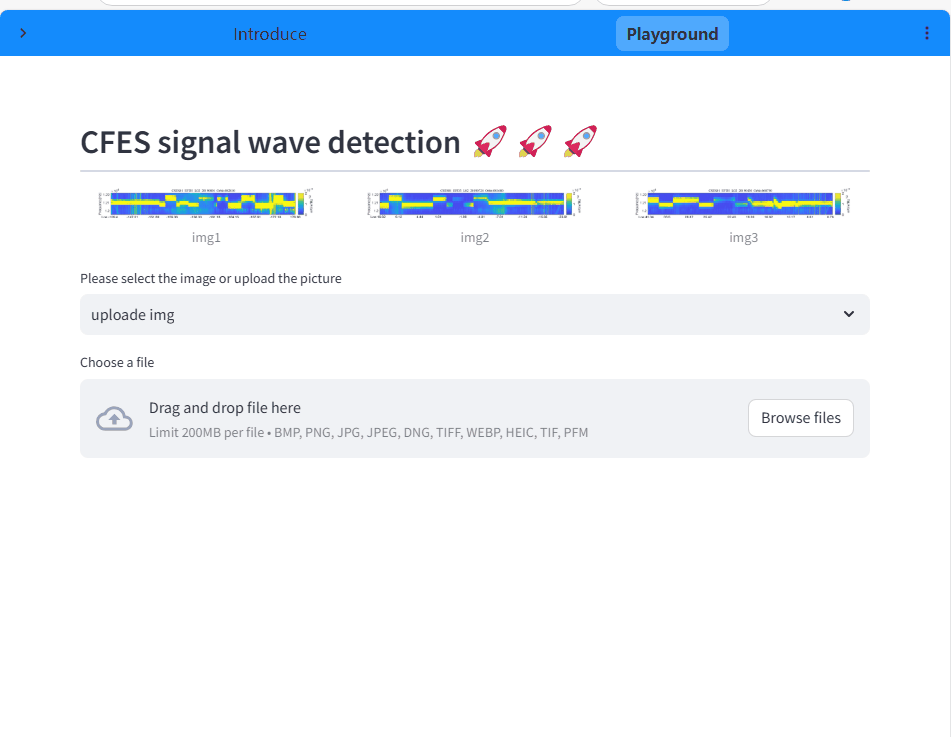

# 恒频电磁信号波动检测系统

## 简介

恒频电磁信号波动检测器用于检测频谱图上恒频电磁信号波动，用户上传一个频谱图然后点击“detect”即可开始检测，检测结果输出在主屏上。本系统基于 YOLOV8 算法进行开发，目标检测速度快，识别精度高，可适配多种硬件平台和下游任务。

---

## 安装

**环境及依赖**

环境要求：python3.10，chrome（推荐）

**依赖库：**

streamlit\==1.33.0
streamlit-navigation-bar\==3.3.0
ultralytics\==8.3.13
numpy\==1.26.0
opencv-python-headless
torch\==2.3.0

**启动项目**

在终端中进入项目主目录，输入 streamlit run app.py 出现下面界面即启动成功。

打开浏览器输出界面中的 URL 即可进入项目操作界面

---

## 快速上手

**1️⃣ 上传图像**

进入 Playground 界面，点击中央的"uploade img"下拉框选择要上传的图像。“uploade img”是用户自定义上传。“img1”至“img3”是系统自带的供用户测试的图片。若选择“uploade img”模式，用户点击下方的上传栏从本地选择图片即可完成上传

**2️⃣ 开始检测**

点击屏幕左上角 ▶️ 按钮唤出隐藏框，设置好参数后（参数设置见 3）点击“detect“开始检测，界面显示“Wait for it...“说明系统正在检测，当图标变成”Done!“后检测完成，结果显示在主界面上。

**3️⃣ 参数设置**

各种参数含义见下表

| 参数名        | 数据类型 | 调节范围    | 参数作用                                                     |
| ------------- | -------- | ----------- | ------------------------------------------------------------ |
| confidence    | float    | (0.00,1.00) | confidence 置信度用于衡量模型对预测框中是否包含目标以及预测框的准确性的信心程度。它反映了模型认为预测框包含目标的概率,在推理阶段，用户可以灵活设置置信度阈值，可以过滤掉那些置信度较低的预测框，只保留置信度高于阈值的框作为最终的检测结果。 |
| iou           | float    | (0.00,1.00) | IOU 是衡量预测框与真实框之间重叠程度的指标。它用于评估模型预测的准确性，特别是在目标定位方面。高 IOU 会保留其中置信度最高的框，去除其他重叠度高的框。低 IOU 会保留更多可能的检测目标。 |
| augment       | boolean  | true/false  | Augment 数据增强在模型检测前对数据进行预处理以提高检测的准确定，使用这个选项会增大算力资源的消耗。 |
| choose device | string   |             | 选择系统计算要使用的处理器（cpu/gpu），在选择之前先点击上方的 check available devices 检测系统可用的处理器，如果系统有 gpu 推荐使用 gpu 加速推理。 |
| reset         |          |             | 点击 reset 按钮重置参数为默认值                              |

---

## 联系我们

Github 地址：https://github.com/Wsz22/cfes

Email：wusizheng@yeah.net

如果觉得项目不错，请我们喝杯咖啡吧 ☕️ ～：
